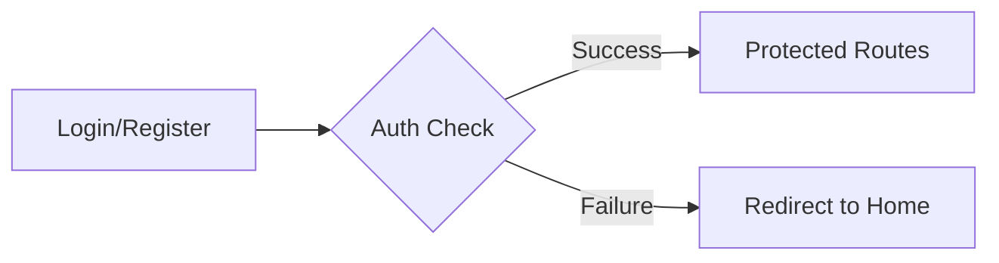
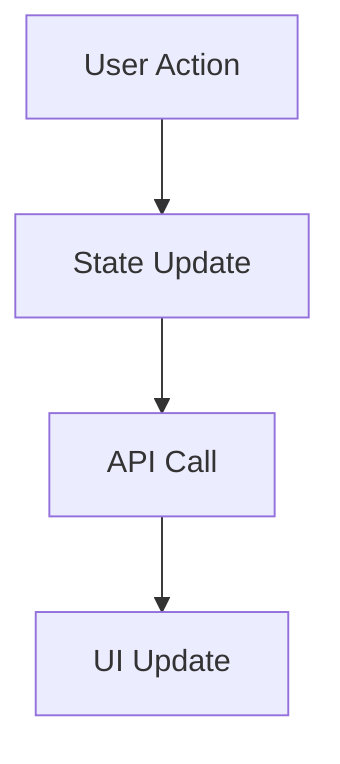

# StayConnected 🌟

<div align="center">
  <p align="center">
    A modern Q&A platform built for knowledge sharing and community engagement
  </p>

  <nav>
    <ul>
      <li><a href="#features">✨ Features</a></li>
      <li><a href="#tech-stack">🛠 Tech Stack</a></li>
      <li><a href="#getting-started">🚀 Getting Started</a></li>
      <li><a href="#architecture">🏗 Architecture</a></li>
      <li><a href="#contributing">🤝 Contributing</a></li>
      <li><a href="#team">👥 Team</a></li>
    </ul>
  </nav>
</div>

## ✨ Features

### 🏠 Homepage

- Dynamic header with authentication state management
- Real-time questions feed
- Interactive leaderboard
- Dark/Light mode toggle

### 👤 User Authentication

- **Registration**
  - Default avatar assignment
  - Secure password handling
- **Login**
  - Email and password validation
  - Protected route handling
  - Seamless authentication flow

### 📝 Questions

- Create detailed questions with tags
- Rich text editing support
- Advanced search and filtering
<!-- - Sort by date, status, or answers -->
- Tag-based categorization

### 💬 Answers

- Best answer highlighting
- Vote system for community feedback
- Like/upvote system

### 👑 Leaderboard System

- Point-based ranking
- Best answer rewards
<!-- - Activity tracking -->

### 👤 User Profiles

- Activity statistics (points)
- Question and answer history

## 🛠 Tech Stack

- **Frontend Framework**: React + TypeScript
- **Build Tool**: Vite
- **Styling**: Tailwind CSS + shadcn/ui
- **State Management**: Jotai
- **Form Handling**: React Hook Form + Zod
- **API Communication**: Axios + React Query
- **Routing**: React Router
- **UI Components**: shadcn/ui

## 👥 Team

Meet our amazing team of React developers:

<table>
  <tr>
    <td align="center">
      <a href="https://github.com/richi1213">
        <b>@richi1213</b>
      </a>
      <br />
      <sub>React Developer</sub>
    </td>
    <td align="center">
      <a href="https://github.com/sopo">
        <b>@sopo</b>
      </a>
      <br />
      <sub>React Developer</sub>
    </td>
    <td align="center">
      <a href="https://github.com/anijujunashvili">
        <b>@anijujunashvili</b>
      </a>
      <br />
      <sub>React Developer</sub>
    </td>
    <td align="center">
      <a href="https://github.com/tsamkharadze">
        <b>@tsamkharadze</b>
      </a>
      <br />
      <sub>React Developer</sub>
    </td>
  </tr>
</table>

## 🚀 Getting Started

1. **Clone the repository**

   ```bash
   git clone https://github.com/richi1213/stay-connected.git

   ```

2. **Install dependencies**

   ```bash
   cd stayconnected
   ```

3. **Install dependencies**

   ```bash
   npm install
   ```

4. **Start the development server**

   ```bash
   npm run dev
   ```

## 🏗 Architecture

### Directory Structure

```
src/
├── components/         # Reusable UI components
├── features/          # Feature-specific components
├── hooks/            # Custom React hooks
├── lib/              # Utility functions
├── pages/            # Route components
├── services/         # API services
├── store/            # State management
└── types/            # TypeScript definitions
```

### Key Components

#### Authentication Flow



#### Data Flow



## 🙏 Acknowledgments

- [shadcn/ui](https://ui.shadcn.com/) for the beautiful UI components
- [Tailwind CSS](https://tailwindcss.com/) for the utility-first CSS framework
- [Vite](https://vitejs.dev/) for the blazing fast build tool

---

<div align="center">
  Made with ❤️ by the StayConnected Team
</div>
